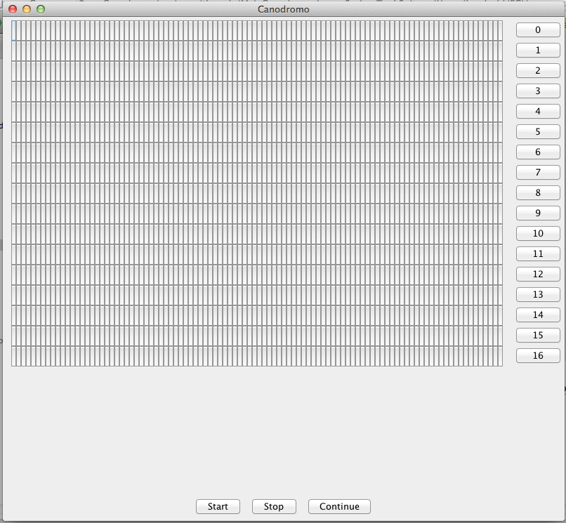
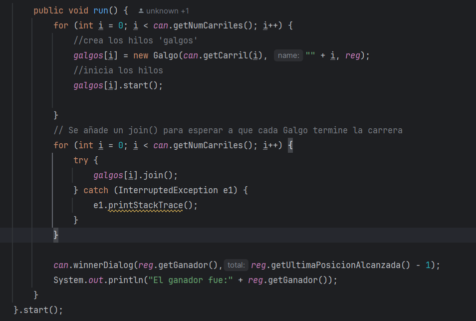
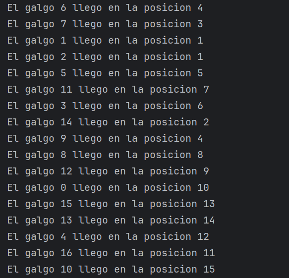
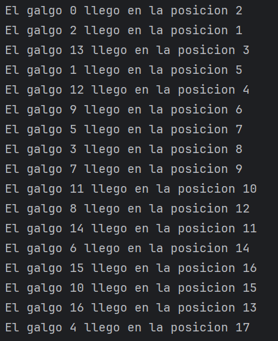

# Arquitecturas de Software (ARSW) - Laboratorio #2

#### Nicolas Toro y Juan José Díaz

## Taller – programación concurrente, condiciones de carrera y sincronización de hilos.

[](https://www.oracle.com/java/)
[](https://maven.apache.org/)

---

Este laboratorio explora los conceptos fundamentales de la programación concurrente y la sincronización de hilos en Java, a través de dos aplicaciones prácticas: un buscador de números primos y un simulador gráfico de carreras de galgos. A lo largo de los ejercicios, se abordan problemas clásicos como condiciones de carrera, regiones críticas, coordinación de hilos y mecanismos de pausa/reanudación, aplicando técnicas de sincronización y buenas prácticas de diseño. El objetivo es comprender y experimentar el impacto de la concurrencia en el desempeño y la consistencia de las aplicaciones.

[laboratorio2](https://github.com/ARSW-ECI-archive/concurrent-prog-dogs-race-master)

### Estructura de archivos del proyecto

```bash
.
├── img/media                    # Imágenes y capturas de pantalla
├── parte1/                      # Proyecto Maven de la parte 1: Números primos concurrentes
│   ├── pom.xml                  # Configuración de Maven para parte1
│   └── src/
│       └── main/
│           └── java/
│               └── edu/
│                   └── eci/
│                       └── arsw/
│                           └── primefinder/
│                               ├── Main.java               # Ejecuta la búsqueda de primos concurrentemente
│                               └── PrimeFinderThread.java  # Hilo que realiza la búsqueda de primos en un rango
├── parte2/                      # Proyecto Maven de la parte 2: simulador de canódromo
│   ├── pom.xml                  # Configuración de Maven para parte2
│   └── src/
│       └── main/
│           └── java/
│               └── arsw/
│                   └── threads/
│                       ├── Canodromo.java        # Interfaz gráfica y lógica principal de la carrera
│                       ├── Carril.java           # Representa un carril de la pista
│                       ├── Galgo.java            # Hilo que representa a un galgo participante
│                       ├── MainCanodromo.java    # Clase principal: inicia la simulación de la carrera
│                       ├── Pausador.java         # Monitor para pausar y reanudar los galgos (sincronización)
│                       ├── RandomGenerator.java  # Utilidad para generación de números aleatorios
│                       └── RegistroLlegada.java  # Controla el registro de llegada de los galgos
├── README.md                      # Documentación del laboratorio
```
  

---

### Ejecutar el Proyecto

Este laboratorio está compuesto por dos proyectos Maven independientes: **parte1** (primos concurrentes) y **parte2** (simulador de canódromo). Cada uno debe compilarse y ejecutarse por separado. A continuación, se describen los pasos para ejecutar ambos proyectos en cualquier sistema operativo compatible con Java y Maven.

#### 1. Requisitos previos

- **Java 17** o superior instalado y configurado en el `PATH`.
- **Apache Maven** instalado y configurado en el `PATH`.
- (Opcional) Un IDE como IntelliJ IDEA, Eclipse o VS Code para facilitar la edición y ejecución.

Verifica las versiones instaladas ejecutando en la terminal:

```bash
java -version
mvn -version
```

#### 2. Clonar el repositorio

Si aún no tiene el repositorio localmente, clónelo con:

```bash
git clone https://github.com/NicoToro25/Laboratorio-2-ProgramacionConcurrente.git
cd Laboratorio-2-ProgramacionConcurrente
```

#### 3. Compilar los proyectos

Cada parte es un proyecto Maven independiente. Debes compilar cada uno por separado:

- **Parte 1: Primos Concurrentes**

```bash
cd parte1
mvn clean package
```

- **Parte 2: Simulador de Canódromo**

```bash
cd ../parte2
mvn clean package
```

#### 4. Ejecutar los proyectos

Para ejecutar cada parte se debe estar en la carpeta específica de cada proyecto `/parte1` o `/parte2` 

- **Parte 1: Primos Concurrentes**

En el directorio `/parte1` ejecute:

```bash
mvn exec:java@parte1
```

- **Parte 2: Simulador de Canódromo**

En el directorio `/parte2` ejecute:

```bash
mvn exec:java@parte2
```

> **Nota:** Si su IDE lo permite, también puede ejecutar directamente las clases principales desde la interfaz gráfica del IDE.

Si se tiene algún inconveniente con la ejecución, asegúrarse de que las variables de entorno de Java y Maven estén correctamente configuradas y de estar ubicado en la carpeta correspondiente antes de ejecutar los comandos.


---

### Parte I

Creación, puesta en marcha y coordinación de hilos.

1. Revise el programa “primos concurrentes” (en la carpeta parte1), dispuesto en el paquete edu.eci.arsw.primefinder. Este es un programa que calcula los números primos entre dos intervalos, distribuyendo la búsqueda de los mismos entre hilos independientes. Por ahora, tiene un único hilo de ejecución que busca los primos entre 0 y 30.000.000. Ejecútelo, abra el administrador de procesos del sistema operativo, y verifique cuantos núcleos son usados por el mismo.

En este caso, el programa utiliza únicamente un hilo, por lo que solo un núcleo del procesador debería estar ocupado a la vez. Sin embargo, sistemas operativos como Windows pueden reasignar dinámicamente el hilo entre diferentes núcleos para balancear la carga o por motivos internos de gestión, lo que puede dificultar la observación directa de este comportamiento en el Administrador de tareas.

Adicionalmente, la presencia de otros procesos y aplicaciones en ejecución en el sistema puede generar actividad en los demás núcleos, haciendo menos evidente cuál es el núcleo utilizado por nuestro programa.


Observamos que el programa tardaba mucho más de lo esperado y que los tiempos de ejecución variaban significativamente al cambiar el número de hilos. Analizando el comportamiento, identificamos que esto se debía a la impresión de todos los números primos encontrados en la consola, lo cual genera un cuello de botella considerable en la ejecución.

Al eliminar la impresión, el programa puede aprovechar realmente el paralelismo. Cada hilo calcula su rango de primos sin esperar a la consola, por lo que el tiempo total disminuye notablemente al usar más hilos.

Por esta razón, decidimos comparar el desempeño del programa en los tres puntos del laboratorio, tanto imprimiendo los números primos como omitiendo la impresión, para obtener una medición realista del tiempo requerido para encontrar los primos.

La modificación para comentar la impresión se realiza en la clase `PrimeFinderThread`:

```java
@Override
    public void run() {
        for (int i = a; i <= b; i++) {
            if (isPrime(i)) {
                primes.add(i);
                //System.out.println(i);
            }
        }
    }
```

Con impresión de números:

```bash
Número de núcleos utilizados: 1
Hilo 1 encontró 1857859 números primos.
Total de primos encontrados: 1857859
Tiempo total de ejecución: 195416 ms -> 3.25 min
```

Sin impresión de números:

```bash
Número de núcleos utilizados: 1
Hilo 1 encontró 1857859 números primos.
Total de primos encontrados: 1857859
Tiempo total de ejecución: 8712 ms -> 0.1452 min
```


2. Modifique el programa para que, en lugar de resolver el problema con un solo hilo, lo haga con tres, donde cada uno de éstos hará la tarcera parte del problema original. Verifique nuevamente el funcionamiento, y nuevamente revise el uso de los núcleos del equipo.
   


Con impresión de números no cambia practicamente nada respecto a ejecutarlo con un solo hilo:

```bash
Número de núcleos utilizados: 3
Hilo 1 encontró 664579 números primos.
Hilo 2 encontró 606028 números primos.
Hilo 3 encontró 587252 números primos.
Total de primos encontrados: 1857859
Tiempo total de ejecución: 182051 ms -> 3.034 min
```

Sin impresión de números si es mucho más rápido que con un solo hilo:

```bash
Número de núcleos utilizados: 3
Hilo 1 encontró 664579 números primos.
Hilo 2 encontró 606028 números primos.
Hilo 3 encontró 587252 números primos.
Total de primos encontrados: 1857859
Tiempo total de ejecución: 3772 ms -> 0.0628 min
```

3. Lo que se le ha pedido es: debe modificar la aplicación de manera que cuando hayan transcurrido 5 segundos desde que se inició la ejecución, se detengan todos los hilos y se muestre el número de primos encontrados hasta el momento. Luego, se debe esperar a que el usuario presione ENTER para reanudar la ejecución de los mismo.


Para implementar la funcionalidad de pausa y reanudación de los hilos, se realizaron los siguientes cambios en la clase `PrimeFinderThread`:

1. **Control de pausa:**  Se agregaron dos nuevos atributos: un objeto `pauseLock` que actúa como candado para la sincronización y un booleano `paused` que indica si el hilo debe estar en pausa.

2. **Lógica de pausa en el ciclo principal:**  Dentro del método `run()`, antes de verificar si un número es primo, el hilo entra en una sección sincronizada sobre `pauseLock`. Si `paused` es `true`, el hilo llama a `wait()` sobre el candado y queda en espera hasta que sea notificado.

3. **Métodos para pausar y reanudar:**  Se implementaron los métodos `pauseThread()` y `resumeThread()`. `pauseThread()` establece `paused` en `true`. `resumeThread()` sincroniza sobre `pauseLock`, cambia `paused` a `false` y llama a `notifyAll()` para despertar a los hilos pausados.

El uso de `wait()` y `notifyAll()` permite suspender y reanudar la ejecución de los hilos de forma segura y coordinada, sin terminar su trabajo ni perder el progreso. Así, el programa puede mostrar el estado parcial del cálculo y continuar exactamente donde se detuvo tras la intervención del usuario.

**Ejecución:** 

```bash
[PAUSA] Hilo 1 ha encontrado 52389 números primos hasta el momento.
20023379
[PAUSA] Hilo 2 ha encontrado 1066 números primos hasta el momento.
[PAUSA] Hilo 3 ha encontrado 1391 números primos hasta el momento.
[PAUSA] Total de primos encontrados hasta ahora: 54846

Presione ENTER para continuar...
...
29999923
29999927
29999941
29999947
29999989
29999999
Hilo 1 encontró 664579 números primos.
Hilo 2 encontró 606028 números primos.
Hilo 3 encontró 587252 números primos.
Total de primos encontrados: 1857859
Tiempo total de ejecución: 184599 ms
```

Para este ejercicio se realizó una busqueda de 300.000.000 sin impresión de números porque con 30.000.000 ya se había acabado la ejecución a los 5 segundos.

```bash
Número de núcleos utilizados: 3
[PAUSA] Hilo 1 ha encontrado 1269018 números primos hasta el momento.
[PAUSA] Hilo 2 ha encontrado 386764 números primos hasta el momento.
[PAUSA] Hilo 3 ha encontrado 277111 números primos hasta el momento.
[PAUSA] Total de primos encontrados hasta ahora: 1932893

Presione ENTER para continuar...

Hilo 1 encontró 5761455 números primos.
Hilo 2 encontró 5317482 números primos.
Hilo 3 encontró 5173388 números primos.
Total de primos encontrados: 16252325
Tiempo total de ejecución: 113324 ms
```
---

### Parte II


Para este ejercicio se va a trabajar con un simulador de carreras de galgos (carpeta parte2), cuya representación gráfica corresponde a la siguiente figura:



En la simulación, todos los galgos tienen la misma velocidad (a nivel de programación), por lo que el galgo ganador será aquel que (por cuestiones del azar) haya sido más beneficiado por el *scheduling* del
procesador (es decir, al que más ciclos de CPU se le haya otorgado durante la carrera). El modelo de la aplicación es el siguiente:


Como se observa, los galgos son objetos ‘hilo’ (Thread), y el avance de los mismos es visualizado en la clase Canodromo, que es básicamente un formulario Swing. Todos los galgos (por defecto son 17 galgos corriendo en una pista de 100 metros) comparten el acceso a un objeto de tipo
RegistroLLegada. Cuando un galgo llega a la meta, accede al contador ubicado en dicho objeto (cuyo valor inicial es 1), y toma dicho valor como su posición de llegada, y luego lo incrementa en 1. El galgo que
logre tomar el ‘1’ será el ganador.

Al iniciar la aplicación, hay un primer error evidente: los resultados (total recorrido y número del galgo ganador) son mostrados antes de que finalice la carrera como tal. Sin embargo, es posible que una vez corregido esto, haya más inconsistencias causadas por la presencia de condiciones de carrera.

**Taller.**

1.  Corrija la aplicación para que el aviso de resultados se muestre
    sólo cuando la ejecución de todos los hilos ‘galgo’ haya finalizado.
    Para esto tenga en cuenta:

    a. La acción de iniciar la carrera y mostrar los resultados se realiza a partir de la línea 38 de MainCanodromo.

    b. Puede utilizarse el método `join()` de la clase Thread para sincronizar el hilo que inicia la carrera, con la finalización de los hilos de los galgos.

Se agrega un `join()` después de que se inicien los Threads con el propósito de sincronizar el hilo principal con la finalización de todos los hilos. Se implementó de la siguiente forma:




2.  Una vez corregido el problema inicial, corra la aplicación varias
    veces, e identifique las inconsistencias en los resultados de las
    mismas viendo el ‘ranking’ mostrado en consola (algunas veces
    podrían salir resultados válidos, pero en otros se pueden presentar
    dichas inconsistencias). A partir de esto, identifique las regiones
    críticas () del programa.

Se puede evidenciar que hay inconsistencias en las clases Galgo y RegistroLlegada, ya que dos o más Galgos (Threads) tienen acceso simultáneo a variables compartidas y por ende, modifican valores al mismo tiempo. Lo que genera inconsistencias como se puede evidenciar en la siguiente imagen, donde los Galgos 1 y 2 llegaron en primera posición.
Por eso es necesario sincronizar las secciones críticas para proteger las variables compartidas



3.  Utilice un mecanismo de sincronización para garantizar que a dichas
    regiones críticas sólo acceda un hilo a la vez. Verifique los
    resultados.

Se añadió un mecanismo de sincronización para solucionar las secciones críticas dando como resultado una correcta asignación de valores de llegada.



4.  Implemente las funcionalidades de pausa y continuar. Con estas,
    cuando se haga clic en ‘Stop’, todos los hilos de los galgos
    deberían dormirse, y cuando se haga clic en ‘Continue’ los mismos
    deberían despertarse y continuar con la carrera. Diseñe una solución que permita hacer esto utilizando los mecanismos de sincronización con las primitivas de los Locks provistos por el lenguaje (wait y notifyAll).

Con el propósito de respetar el principio de single responsibility, se agregó una clase llamada Pausador, cuya principal funcionalidad es ser un *monitor compartido* que permite coordinar todos los hilos (Galgos).

El botón Stop es completamente funcional, los galgos paran hasta que se oprima el botón Continue como vemos en esta captura de pantalla:


Además en la terminal nos indica también que la carrera fue pausada:

`Carrera pausada!`

Podemos pausar la carrera tantas veces como queramos a lo largo de la carrera.

---

#### Bono

5. Además de los requisitos funcionales pedidos en la parte 2 del laboratorio, se implementó una nueva funcionalidad que permite reiniciar
la carrera sin necesidad de cerrar la aplicación. Se añadieron métodos y se completaron muchos otros donde se vieron
modificadas las clases MainCanodronomo, Canodromo, Galgos y Carriles. Esta funcionalidad permitió explorar la palabra clave
volatile, reflejando su importancia y la solución ante un problema de visibilidad y consistencia de memoria.


La funcionalidad de reiniciar la carrera funciona correctamente, esto se gestiona principalmente desde la clase `MainCanodromo`, que controla la interfaz gráfica y la lógica de la simulación. Cuando el usuario pulsa el botón de "Reiniciar", se ejecuta la acción definida en `setRestartAction`, que realiza los siguientes pasos:

1. **Detener todos los galgos:**  
    Se recorre el arreglo de galgos (`galgos[]`) y se llama al método `detener()` de cada uno. Este método, en la clase `Galgo`, establece la variable `running` (declarada como `volatile` para garantizar la visibilidad entre hilos) a `false`, lo que provoca que el hilo del galgo termine su ejecución de manera segura.

2. **Reiniciar el estado visual de los carriles:**  
    Se llama al método `restart()` del objeto `Canodromo`. Este método recorre todos los objetos `Carril` y ejecuta su método `reStart()`, que limpia los pasos visuales y restablece la bandera de llegada a su estado inicial (color y texto).

3. **Reiniciar el registro de llegada:**  
    Se crea una nueva instancia de `RegistroLlegada`, que es el objeto encargado de llevar el control de los galgos que han llegado a la meta.

4. **Preparar la interfaz para una nueva carrera:**  
    Se habilita el botón de inicio (`butStart`) y se deshabilitan los botones de pausa, continuar y reinicio, permitiendo que el usuario pueda iniciar una nueva carrera desde cero.

Este flujo asegura que tanto la lógica interna (hilos y estado de llegada) como la interfaz gráfica (carriles y botones) se restablecen completamente, permitiendo una nueva simulación sin interferencias del estado anterior.

Una vez reiniciada la carrera vemos una interfaz limpia para iniciar una nueva carrera y vemos el mensaje en la terminal:

`Carrera reiniciada!`

---


### Autores

Nicolás Esteban Toro - [github](https://github.com/NicoToro25)

Juan José Díaz - [github](https://github.com/Juan-Jose-D)

Escuela Colombiana de ingeniería Julio Garavito